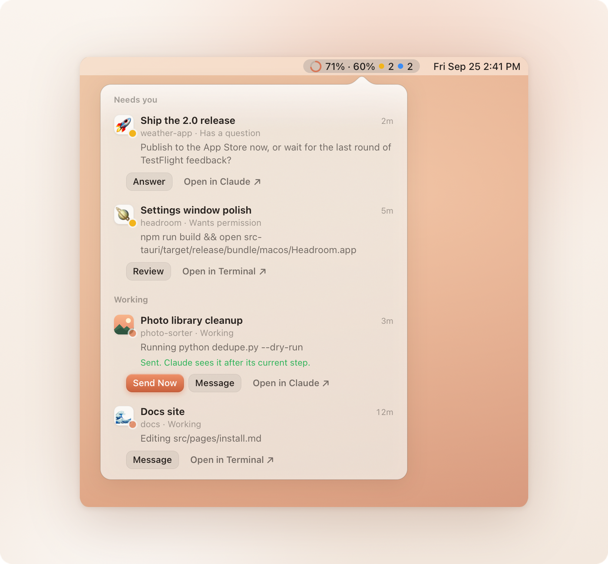
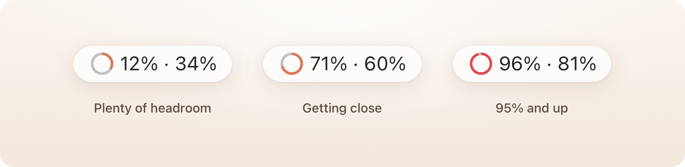
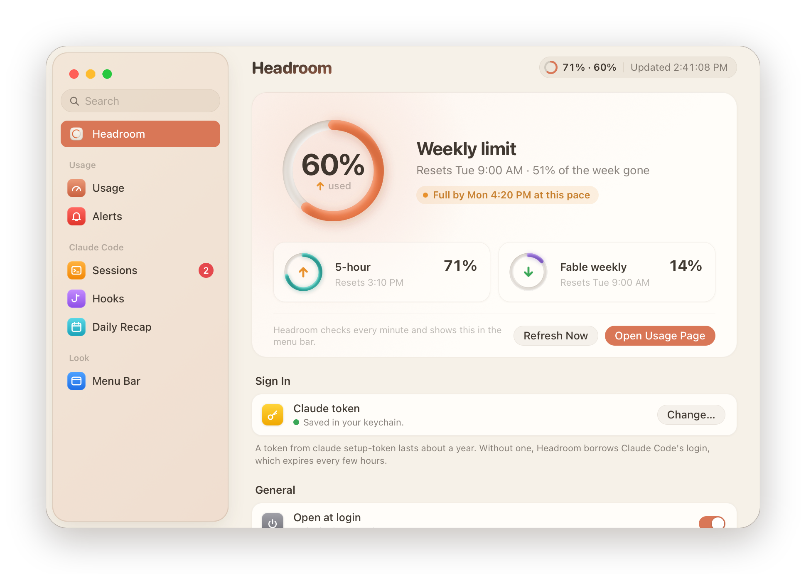
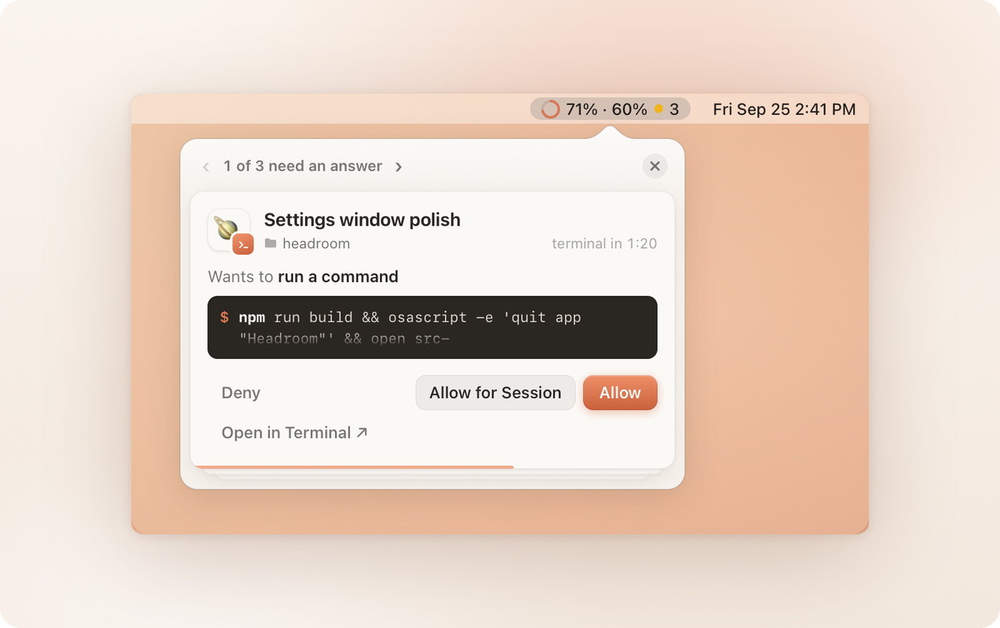
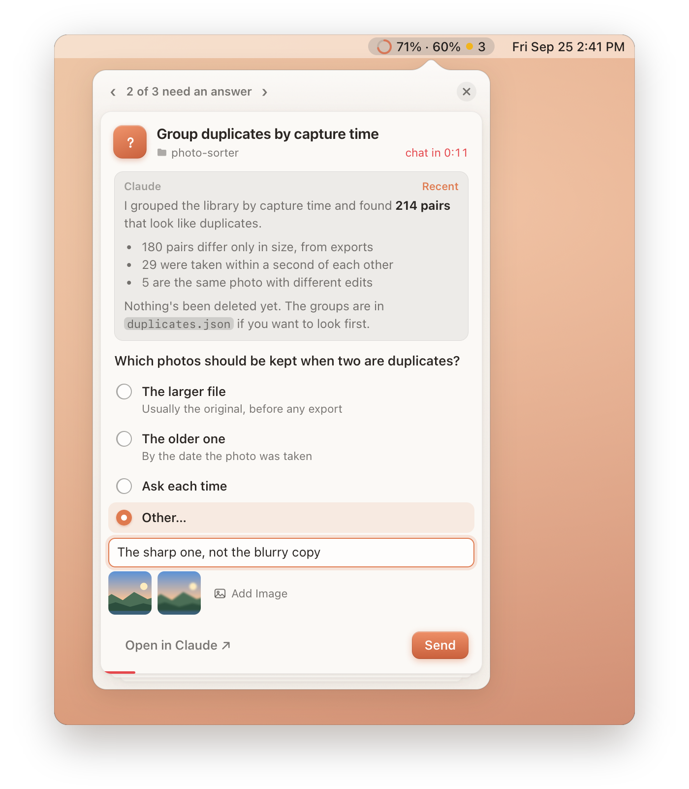
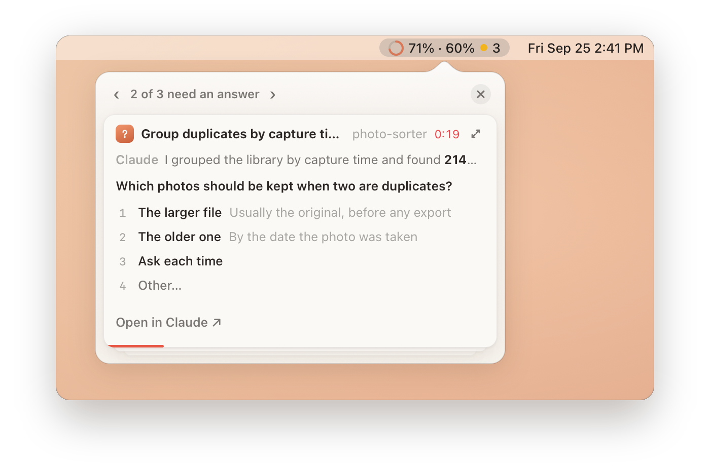
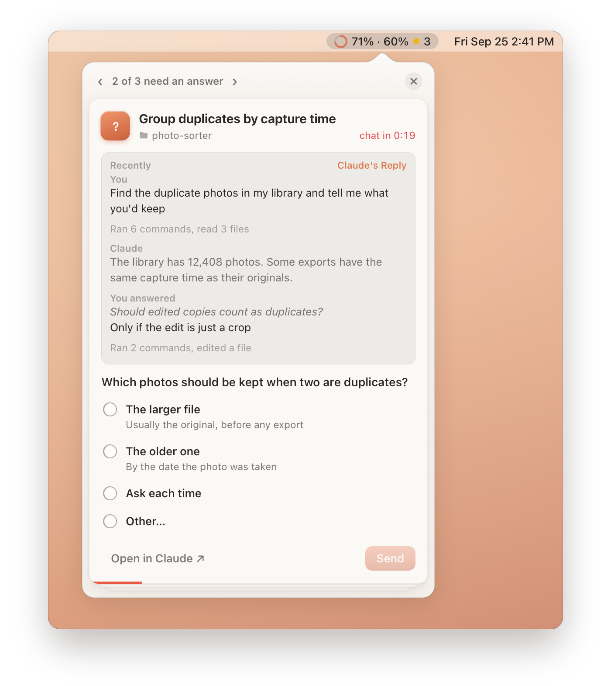
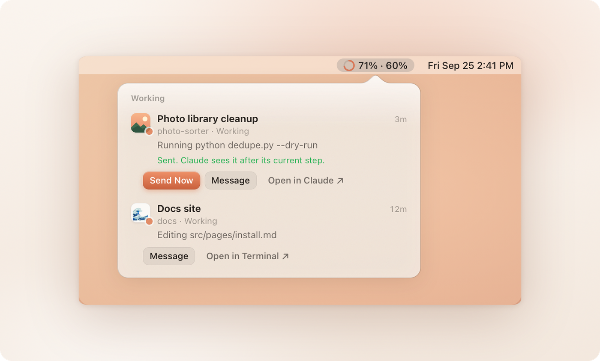
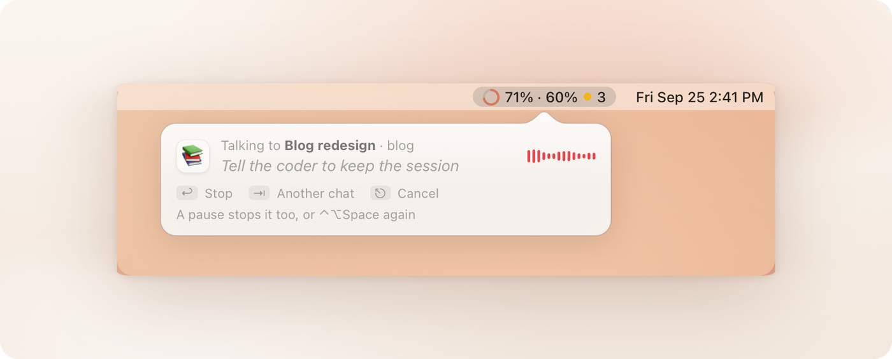

<br>

<p align="center">
  <picture>
    <source media="(prefers-color-scheme: dark)" srcset="assets/readme/wordmark-dark.png">
    
  </picture>
</p>

<p align="center">Your Claude usage and Claude Code sessions, right in the Mac menu bar.</p>

<p align="center">
  <a href="https://github.com/dylan-hepworth/headroom/releases/latest"></a>
</p>

<p align="center"><sub>Free and open source. Mac only (macOS 11 or newer).</sub></p>

<p align="center">
  <a href="https://github.com/dylan-hepworth/headroom/releases/latest"></a>
  <a href="https://github.com/dylan-hepworth/headroom/releases"></a>
  
  <a href="LICENSE"></a>
  <a href="https://github.com/dylan-hepworth/headroom/stargazers"></a>
  <a href="https://github.com/dylan-hepworth/headroom/commits/main"></a>
  <a href="https://tauri.app"></a>
</p>

<br>

<p align="center">
  <picture>
    <source media="(prefers-color-scheme: dark)" srcset="assets/readme/hero-dark.png">
    
  </picture>
</p>

<br>

You've probably got Claude doing a few things at once. One session is writing code, another is pulling a report together, and another is halfway through something you started this morning. Meanwhile you're checking email, answering questions in Slack, reading someone's PR, and hopping on a call. By the time you look back, one of them has been waiting on you for twenty minutes, and you're closer to your weekly limit than you thought.

Headroom keeps all of that in the menu bar: how much of your limits you've used, which sessions are working, which ones need you, and the decisions they're waiting on. You can see it all and answer from one spot, without hunting through windows.

<br>

<table>
  <tr>
    <td width="33%" align="center" valign="top">
      <br>
      <br>
      <b>Usage</b><br>
      Your 5-hour and weekly limits at a glance, and when each one resets.
      <br><br>
    </td>
    <td width="33%" align="center" valign="top">
      <br>
      <br>
      <b>Sessions</b><br>
      Which Claude Code sessions are working and which are waiting on you, with a message to any of them a click away.
      <br><br>
    </td>
    <td width="33%" align="center" valign="top">
      <br>
      <br>
      <b>Approvals</b><br>
      Answer permission requests and Claude's questions from a panel under the icon.
      <br><br>
    </td>
  </tr>
</table>

<br>

### Usage in the menu bar

Headroom shows your 5-hour and weekly usage right in the menu bar, so you know how much room is left before you start something big. A little ring next to the numbers fills up with your weekly usage, and turns red when either limit passes 95%.

<p align="center">
  <picture>
    <source media="(prefers-color-scheme: dark)" srcset="assets/readme/usage-dark.png">
    
  </picture>
</p>

The menu shows when each one resets, and Settings has the rest:

- **Pace**: how far through each window you are, and whether you'll hit the limit at the rate you're going. Turn on **Pace arrows** and each limit gets a little arrow, up in orange when you're using it faster than the window is going by and down in green when you've got room to spare, in the menu bar and in Settings.
- **Alerts**: one notification when either limit passes a level you pick, not one on every check. The notification has buttons to move the alert to a level still ahead, like 70%, 80%, or 90%.
- **Usage by project**: each project's rough share of your Claude Code use in the current 5-hour window, from the transcripts on this Mac (so claude.ai and your other Macs aren't counted).
- **Daily recap**: a notification each evening you've used Claude Code, with the time you spent, your top projects, your 5-hour peak, and how far your weekly usage went up.

Settings opens on all of it at once: the weekly limit up top, with the 5-hour limit and any model's own weekly limit, like Fable's, underneath. The arrows tell you which ones to ease off.

<p align="center">
  <picture>
    <source media="(prefers-color-scheme: dark)" srcset="assets/readme/settings-dark.png">
    
  </picture>
</p>

<br>

### Sessions waiting on you

When you've got a few Claude Code sessions going, the one that needs you is rarely the one in front of you. Headroom keeps track of all of them, in a terminal or in the Claude app, so you don't have to go looking.

Turn on **Hooks** in Settings and a yellow dot in the menu bar counts the sessions that need an answer, and a blue one counts the ones that are done. Headroom can send a notification for either.

Each chat gets an icon of its own, an emoji to start with, so you can tell at a glance which one wants you: in the list, on its cards, and at the front of its notifications. Click it in the list or in the Sessions pane to search for another emoji or pick a picture from your Mac, for that chat or every chat in the same project.

With **Approve from the menu bar** on as well, when a session asks for permission, a panel drops down from the icon with what it wants to do, full command and all. Answer it right there with **Allow** or **Deny** (or **Allow for Session**, when Claude Code offers it), or in the terminal like before. Whichever you get to first wins. If a few pile up, they stack, and you can flip or swipe through them.

<p align="center">
  <picture>
    <source media="(prefers-color-scheme: dark)" srcset="assets/readme/approvals-dark.png">
    
  </picture>
</p>

Each card counts down to when it goes back to the terminal. If you don't get to it in time (2 minutes unless you change it), or Headroom isn't running, it's back to Claude Code's own prompt, like it normally would be. When it's nearly out, the time turns red, and pointing at the card pauses the clock for up to 2 more minutes. It only holds what Claude Code would have asked you about anyway, and it stays out of the way while you're looking at that session. [More on how the hooks work](#claude-code-sessions).

<br>

### Answering Claude's questions

Claude's multiple-choice questions show up in the same panel. Pick an answer, or write your own under **Other…**, and hit **Send**. When Claude asks a few at once, **Next** steps through them and **Send** sends them all together. Or click **Open in Claude** (or **Open in Terminal**) to answer in the conversation itself.

When it's easier to show than to explain, your own answer can bring images along: paste a screenshot into it, drop an image on it, or pick one with **Add Image**. Claude gets each one as a file it can open and look at.

<p align="center">
  <picture>
    <source media="(prefers-color-scheme: dark)" srcset="assets/readme/question-dark.png">
    
  </picture>
</p>

Turn on **Have Claude ask what's next** as well, and Claude ends each turn by asking you what to do next, in the same panel, with **That's all for now** to let it stop. If a turn ends without the question, Headroom sends Claude back to ask it.

<br>

### Compact cards

If the cards are more than you want on screen, turn on **Compact cards** (Settings → Hooks). Each request fits in a few lines: the chat, one line of Claude's reply, and the options, each with its number key. Point at anything that's cut off to read all of it, press a number to answer, or click the expand button for the whole card.

<p align="center">
  <picture>
    <source media="(prefers-color-scheme: dark)" srcset="assets/readme/compact-dark.png">
    
  </picture>
</p>

<br>

### Hands-free

Add **Hands-free** to asking what's next, and you can keep your sessions going from the menu bar without opening a chat. Each question comes with what Claude said that turn, scrolling if it's long. **Recent** shows what's gone on lately instead: your messages and answers, Claude's updates, and what it did in between ("Ran 3 commands, edited 2 files"), put together by Headroom from the session's transcript, so it costs no tokens. Claude is asked to end with a short summary of what it did, which is all it writes extra.

<p align="center">
  <picture>
    <source media="(prefers-color-scheme: dark)" srcset="assets/readme/handsfree-dark.png">
    
  </picture>
</p>

Click the menu bar icon and every chat waiting on you or at work drops down in a list, like the one at the top (right-click the icon for the menu). Requests come first, then chats at work with what they're doing, then finished chats with the start of Claude's last reply. Click one with a request to bring up its card, or any other to open it where it runs. **Reply** answers a finished chat right there, images and all, and **Mark as Seen** takes one off the list (and its dot off the menu bar) without opening it.

What Claude made that turn comes along too, on its card and its row: the documents and pictures it wrote, the files it sent you, and the documents and links its reply names. A picture shows as a thumbnail. Click a file to see it in Quick Look, over whatever you're doing, or a Markdown file to read it right in the panel, tables and all.

**Message** tells a chat at work something. Claude sees it after the command or edit it's running, or when it finishes, if that comes first. If it's partway through a long command, **Send Now** stops that command, the way Esc does in Claude Code, and Claude reads your message right away.

<p align="center">
  <picture>
    <source media="(prefers-color-scheme: dark)" srcset="assets/readme/sendnow-dark.png">
    
  </picture>
</p>

For a finished chat to take a reply from the menu bar, its turn waits for one, for as long as requests are held (2 minutes unless you change it). Meanwhile the chat looks like it's still working. It lets go as soon as you open that chat yourself or turn hands-free off, and a turn you've ended with **That's all for now** isn't held at all. To hand your messages over, Claude Code waits for Headroom after each step while hands-free is on, about 20 ms each time.

<br>

### Talking instead of typing

Every box Headroom has you write in has a mic: answers, replies, messages to a chat at work, and the planner. Click it and talk, and it stops when you pause, or hold it down while you talk and let go when you're done. It uses macOS's own speech recognition, on your Mac wherever it can.

To talk to a chat from anywhere, press ⌃⌥Space. A panel drops down from the menu bar, already listening, and sends what you say to the chat you last followed, the way **Message** or **Reply** would. A chat that can't take it from Headroom right then gets it copied, and opened for you to paste. ⇥ picks another chat, ↩ sends, and ⎋ lets it go. Pick a different shortcut, or turn it off, in Settings → General.

<p align="center">
  <picture>
    <source media="(prefers-color-scheme: dark)" srcset="assets/readme/talk-dark.png">
    
  </picture>
</p>

macOS asks once to let Headroom use the microphone and speech recognition.

<br>

### Planning a team

**Plan Agents…** in the menu opens the planner: a grid where you lay out a team of agents and draw who reports to whom. Each one gets a name, an icon, a model (Opus, Sonnet, or Haiku), standing instructions, the commands and skills it should use, and what it's allowed to do: read files, edit them, run commands, or browse the web. An arrow can loop back, so a coder's work goes to a reviewer until it's approved (up to however many rounds you say), and any agent can be told to keep going until something's true, like the tests passing.

<p align="center">
  <picture>
    <source media="(prefers-color-scheme: dark)" srcset="assets/readme/planner-dark.png">
    
  </picture>
</p>

**Add to a Chat…** hands the plan to a Claude Code chat you pick, which becomes the Lead. Each manager runs as a Claude Code session of its own, in the background, in the Lead's folder, with its workers as its subagents. It gets only the tools its boxes allow, anything else is refused rather than asked about, and it reports back to the Lead's chat when it's done. While they work, the planner follows them on the same grid: what each agent's doing, the round each loop's on, each manager's report as it comes in, and a box to message the Lead or a manager. Stop them all from there, or by quitting Headroom. Teams are saved as templates, so **New**, **Open**, **Save**, and **Save As…** work like they do in any document app, and a starting example is there to pull apart. **Export…** and **Import…**, in the same menu, pass a team along as a file.

**Plan with Claude…** shares the plan with a chat, which is told where the plan's file is and how to change it. What Claude changes shows on the grid as it lands, what you change goes into the same file for Claude to see, and the panel lists who changed what, with **Undo** for the last change, whoever made it. A shared plan saves as it's changed.

A team that's at work can be changed too. **Change**, in its bar, lets you edit the grid, with each change outlined, and **Send Changes** takes them to whoever they're for: a manager fits its team's changes in after its current step (a new worker runs as a general-purpose subagent, with its own instructions and model), a new manager starts, a removed one stops, and the Lead hears what changed. What a running session can't take, like a worker that needs a tool its manager wasn't started with, is said rather than sent.

The grid zooms with a pinch, ⌘+ and ⌘−, or the buttons in its corner, and pans with a scroll, or a drag with the space bar held. Drag across it to pick several agents (or ⇧-click them, or ⌘A), then drag any of them to move them all, give them all one model, or delete them together.

The managers' work counts toward your usage like any other Claude Code session.

<br>

### Telling Claude about your limits

Turn on **Add a note when I'm near a limit** in the Hooks settings, and once you're past 85% (or whatever you pick), your messages carry a short note so Claude can wrap up or save its progress before you run out.

<br>

Built with [Tauri](https://tauri.app). To get it running, see [Install](#install) and [Signing in](#signing-in).

<br>

## Install

### Download it

Grab the `.dmg` from the [latest release](https://github.com/dylan-hepworth/headroom/releases/latest), open it, and drag Headroom into Applications. It works on both Apple Silicon and Intel Macs, it's signed and notarized by Apple, and it updates itself from then on.

### Let your agent build it

Clone this repo, open it in Claude Code (or Codex, Cursor, whatever you use), and type **Go**. [AGENTS.md](AGENTS.md) walks your agent through checking your tools, building the app, and putting it in Applications.

### By hand

You'll need Xcode's command line tools, Rust, and Node 18 or newer. Skip whatever you already have:

```bash
xcode-select --install
curl --proto '=https' --tlsv1.2 -sSf https://sh.rustup.rs | sh
brew install node
```

Then build it and move it into Applications:

```bash
git clone https://github.com/dylan-hepworth/headroom.git
cd headroom
npm install
npm run build
cp -R src-tauri/target/release/bundle/macos/Headroom.app /Applications/
open /Applications/Headroom.app
```

The first build takes a few minutes. After that it's quick.

## Signing in

Headroom needs a way to read your usage. There are two options.

**Use a token (recommended).** Run `claude setup-token` in Terminal, approve it in your browser, and copy the `sk-ant-oat01-…` token it prints. Then click Headroom in the menu bar, choose **Settings…**, click **Set Token…** under Sign In, paste it, and hit Save. The token lasts about a year and is stored in your keychain.

**Or use your Claude Code login.** If you don't set a token, Headroom reads the login Claude Code keeps in your keychain. macOS will ask once; click Always Allow. The catch is that those logins expire every few hours, and Headroom won't refresh it for you because that can sign Claude Code out. So if you haven't used Claude Code in a while you'll see a ⚠ until you do.

A token's check only reports the 5-hour and weekly limits. If your plan has a weekly limit of its own for a model, like Fable's, Headroom reads that with your Claude Code login while it's fresh, even with a token set, so it comes and goes with that login.

## Using it

Click the menu bar item and you get your **5-hour** and **Weekly** usage, with when each one resets (plus a model's own weekly limit, like Fable's, if your plan has one), **Open Usage Page**, **Refresh Now**, **Settings…** (⌘,), and **Check for Updates…**. While a session is waiting on an answer, there's also **Show Waiting Requests**. With Hands-free on, a click opens the list of your chats instead (or the requests, while any are waiting), and the menu is a right-click away. **Plan Agents…** opens the planner. **Pause Alerts and Requests** quiets Headroom for 30 minutes, an hour, 3 hours, until tomorrow morning, or until you resume: no alerts, and requests go to each session's own prompt instead of dropping down.

Everything else is in Settings:

- **Usage**: each limit, how far through its window you are, and when you'd hit it at the pace you're going
- **Alerts**: a notification when either limit passes 50, 60, 70, 80, 90, or 95%, and when a conversation's context is filling up (see below). Alerts stay on screen until you close them, as long as macOS's alert style for Headroom is Persistent; Alerts has a button that opens that setting, since apps can't change it themselves. Turn off **Keep alerts on screen** and Headroom clears each one after a few seconds instead. Hit **Send Test Alert** once so macOS asks for notification permission.
- **Menu Bar**: both limits, just one, the 5-hour limit with a countdown to when it resets, or just rings with no numbers, including a third, violet ring for a model's own limit like Fable's. Turning the ring off puts back a ✻ that turns 🟠 at 80% and 🔴 at 95%. **Pace arrows** adds ↑ or ↓ to each limit, in the text or inside its ring.
- **Check usage every** 30 seconds, 1, 5, 10, or 30 minutes, **Open at login**, the shortcut for talking to a chat (⌃⌥Space unless you change it), your sign-in, and updates. Headroom checks for updates on its own once a day and tells you when there's a new version.

The search at the top of the sidebar (⌘F) finds any setting, typos and half-typed words included.

If you get rate limited, Headroom waits as long as it's told to before trying again, and the menu shows when that'll be.

### Claude Code sessions

Turn on **Hooks** in Settings and Headroom keeps track of your Claude Code sessions: which ones are working, and which are waiting on you, either for permission or for your next message. The **Sessions** pane lists them by their chat titles. The menu bar shows a yellow dot and count for sessions that need you and a blue one for sessions that are done. For chats in the Claude app, the dots follow the app's own list: a turn that ended with Claude asking you something in plain text counts as needing you, a chat's dot goes once you've opened it there, and archived chats don't get one. Sessions in a terminal stay blue until your next message. Headroom can send a notification for either (Settings → Alerts; not for a request the panel opens for anyway, or one from the chat you have open), plus one when a usage limit resets while a session was stopped at it, and one when a conversation's context passes a share of its window you pick (70% unless you change it), read from the session's transcript. Clicking one opens the session: its request in the panel if one's waiting, its chat if it's in the Claude app, or its terminal.

It works by adding a few [hooks](https://code.claude.com/docs/en/hooks) to `~/.claude/settings.json`, which have Claude Code tell Headroom when something happens in a session. They run in the background, so they don't slow a session down. The exceptions are the near-limit note, approvals, and hands-free, where Claude Code waits on Headroom on purpose. Headroom only keeps what it shows you (the folder, the tool and its command or file, Claude's questions and their options, and the start of Claude's reply), never what you type. The exception is **Hands-free**: when a question comes in, your recent messages and answers (the last few, shortened) are kept with it, in a file only you can read, until it's answered. So is a message you send a chat from the list, until the chat takes it or ends. Turning Hooks off takes them back out and leaves the rest of your settings alone.

Claude Code picks up the change in sessions that are already running, at their next step.

<details>
<summary><b>The near-limit note</b></summary>

<br>

With **Add a note when I'm near a limit** on (Settings → Hooks), each message you send to Claude Code once usage passes your threshold carries a short note for Claude, like "the user is at 91% of their 5-hour Claude limit, which resets at 3:10 PM (in 29 minutes)", so it can wrap up or save its progress before you run out. You can write what you'd like Claude to do instead, and pick **Right away** to have sessions that are working get it after their next step too. Idle sessions are never touched; they get it with your next message. Claude Code waits about 20 milliseconds for Headroom to add it.

</details>

<details>
<summary><b>Approvals and questions in detail</b></summary>

<br>

With **Approve from the menu bar** on (Settings → Hooks), a session's permission requests and Claude's questions come to Headroom too. Claude Code still shows its own prompt for a permission request, so you can answer in either place, and whichever comes first counts. A question waits in Headroom until you answer it, or open it in its conversation. A panel drops down from the menu bar icon with the request. A permission request shows what the session wants to do, full command or file included, with **Allow**, **Deny**, and **Allow for Session** when Claude Code offers it (don't ask again until the session ends; it isn't saved to your settings). A question shows Claude's options: pick one, or several when Claude asks for that, or write your own under **Other…**, and hit **Send**. A held question can only send words back to Claude Code, so images you add to your own answer are saved in Headroom's folder (`~/Library/Application Support/io.github.dylan-hepworth.headroom/attachments`), and the answer tells Claude where each one is. They're cleared out after a week.

If a few are waiting, they stack, and you can flip through them with the arrows, ← →, or a swipe. ✕ puts the panel away without answering anything. While requests are waiting, clicking the menu bar icon brings the panel back instead of the menu (right-click for the menu), and so does **Show Waiting Requests** in the menu. The **Sessions** pane can answer too: permission requests have their own buttons there, and questions have an **Answer…** button that opens the panel.

If the cards take up too much room, turn on **Compact cards** (Settings → Hooks). Each request fits in a few lines: the chat on one line, Claude's reply cut to one more, and the options below it with their number keys. Point at the reply, an option, or a command to read all of it. One click, or the number, answers a question, unless it takes more than one pick or your own words. The expand button shows the whole card for that request.

The panel opens on its own when a new request comes in, but it doesn't take the keyboard, so it won't swallow what you're typing. Once you click into it, ↩ allows or sends, ⌘↩ allows for the session, and esc denies. Turn off **Open automatically when a session needs an answer** and requests wait behind the yellow dot until you click the icon. To quiet it for a while instead, use **Pause Alerts and Requests** in the menu bar's menu.

Each request counts down to when it goes back to the terminal, 2 minutes unless you change it. Near the end the time turns red, and pointing at the card pauses it, for up to 2 extra minutes in total. Claude Code asks you itself, as usual, if you click **Open in Claude** (**Open in Terminal**, for a session in a terminal), turn approvals off, quit Headroom, or interrupt the session. That button takes you there too: to its chat in the Claude app, or to the app it runs in.

It only holds what Claude Code would have asked you about anyway, so requests your permission settings or mode already cover aren't held. Questions are held in any mode, including when Claude asks several at once. Plan approvals always stay in the terminal. Nothing is held while you're looking at the session, since you're probably watching its prompt: its terminal is in front, or its chat is the one open in the Claude app. A request from any other chat still comes to the panel.

With **Have Claude ask what's next** on, each message you send carries a short note asking Claude to end its turn with that question, with **That's all for now** as the last choice. If a turn ends without it, Headroom's hook sends Claude back to ask. If Claude still doesn't, it's left alone until your next message. Sessions that are already open hear about it with your next message, as long as they started while approvals were on (others pick it up when they restart), and turning it off tells the ones that heard to stop. For this, Claude Code waits a moment for Headroom (about 20 milliseconds) on each message and at the end of each turn, while approvals are on.

</details>

## How it works

With your Claude Code login, Headroom calls the same usage endpoint Claude Code uses.

Tokens from `claude setup-token` aren't allowed to call that endpoint, so with a token Headroom sends a one-token request to Claude Haiku on each check and reads your usage from the rate limit headers that come back. That uses a tiny sliver of your limit, so I'd stick with 5 minutes or longer.

Neither of these is a documented public API, so they could change. If Headroom breaks, that's probably why.

For chats in the Claude app, Headroom also reads what the app keeps about each one (how Claude sorted the last turn, and whether the chat is archived) and follows which chat is open from the app's log, to match its dots. None of that is documented either, so if the app changes it, those sessions fall back to working like a terminal session.

### Usage by project and the daily recap

The Usage pane shows each project's share of your Claude Code use on this Mac in the current 5-hour window, and the Daily Recap pane sends a notification at the end of the day with the time you spent, the sessions, the top projects, and how your limits moved. Both come from the transcripts Claude Code keeps in `~/.claude/projects`, so they work without hooks.

## Development

```bash
npm install
npm run dev
```

Almost everything lives in [`src-tauri/src/main.rs`](src-tauri/src/main.rs). The Claude Code hooks are in [`hooks.rs`](src-tauri/src/hooks.rs), and [`sessions.rs`](src-tauri/src/sessions.rs) keeps track of what they report. The settings window is in [`src/`](src), and `npm run ui` opens it in a browser on made-up data, so you can work on it without building the app. The approvals panel is [`src/Popover.tsx`](src/Popover.tsx); add `?popover` to that address to see it, `?pending` for the list of chats, `?popover&talk` for the talk panel, and `?planner` for the planner (`?planner&running` for a team at work). The planner's teams are started in [`team.rs`](src-tauri/src/team.rs), and speech is [`speech.rs`](src-tauri/src/speech.rs). Cutting a release is in [RELEASING.md](RELEASING.md).

## Uninstall

Turn off **Hooks** and **Open at login** in Settings if they're on, quit Headroom from its menu, and delete `/Applications/Headroom.app`. To remove the saved token too:

```bash
security delete-generic-password -s Headroom -a token
```

<br>

<p align="center"><sub>Not affiliated with Anthropic. Provided as is, with no warranty: you use it at your own risk. <a href="LICENSE">Apache 2.0 license</a>: fork it, change it, ship it, as long as the <a href="NOTICE">NOTICE</a> file goes with it and you say what you changed.</sub></p>
